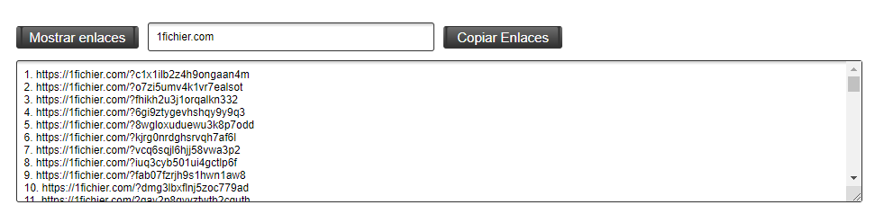

# Mostrar Enlaces Extension

Esta es una extensión para el navegador que te permite mostrar y copiar los enlaces de una página web específica.

## Funcionalidad

La extensión agrega un botón "Mostrar enlaces" en la página web cuando se activa. Al hacer clic en el botón, la extensión buscará todos los elementos en la página que contengan un texto específico y tengan un atributo "href". Luego, mostrará los enlaces encontrados en un textarea enumerado.

Además, la extensión también proporciona un botón "Copiar Enlaces" que copiará los enlaces sin enumeración al portapapeles cuando se haga clic en él.

## Instrucciones de Uso

1. Instala la extensión en tu navegador.
2. Abre una página web en la que desees mostrar y copiar los enlaces.
3. Haz clic en el botón "Mostrar enlaces" que se agregará en la página.
4. Ingresa el texto específico en el campo de entrada y presiona Enter.
5. Los enlaces encontrados se mostrarán en un textarea enumerado.
6. Si deseas copiar los enlaces sin enumeración, haz clic en el botón "Copiar Enlaces".

¡Disfruta de la funcionalidad de Mostrar Enlaces Extension!

## Capturas de Pantalla

Aquí se muestra una captura de pantalla de la extensión en acción:

## Contribuciones

Las contribuciones son bienvenidas. Si deseas contribuir a esta extensión, por favor, realiza los siguientes pasos:

1. Realiza un fork de este repositorio.
2. Crea una nueva rama para tus cambios: `git checkout -b feature/nueva-funcionalidad`.
3. Realiza tus modificaciones y guarda los cambios.
4. Envía tus cambios al repositorio remoto: `git push origin feature/nueva-funcionalidad`.
5. Abre una solicitud de extracción en este repositorio.

## Problemas

Si encuentras algún problema o tienes alguna sugerencia, por favor, abre un [issue](https://github.com/tu-usuario/tu-repositorio/issues) en este repositorio.

## Licencia

Este proyecto está bajo la Licencia MIT. Puedes consultar el archivo [LICENSE](LICENSE) para obtener más detalles.
